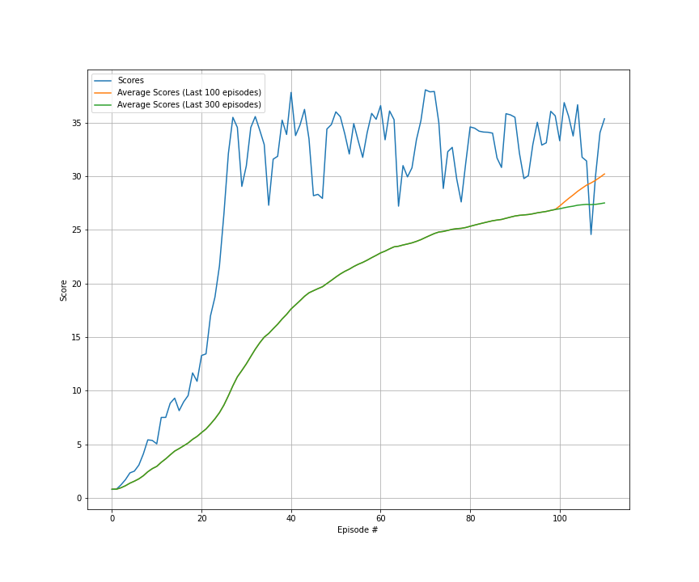
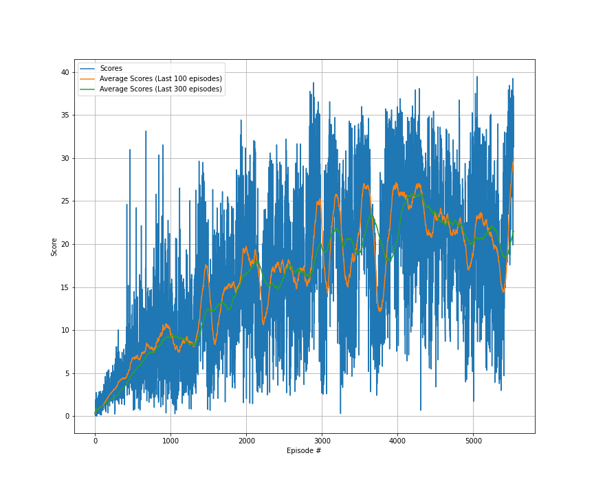
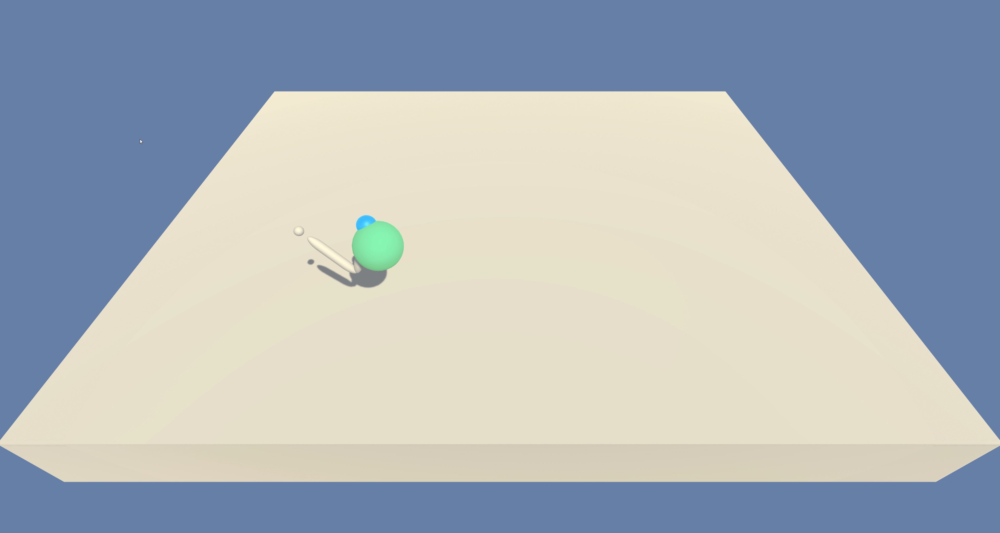

# Report of the project

### Table of Contents

1. [Introduction](#introduction)
2. [Learning Algorithm](#LA)
3. [Hyperparameters](#hyper)
4. [Results](#Results)
5. [Next Steps](#NextSteps)

## Introduction 

In this environment, a double-jointed arm can move to target locations. A reward of +0.1 is provided for each step that the agent's hand is in the goal location. Thus, the goal of your agent is to maintain its position at the target location for as many time steps as possible.
The observation space consists of 33 variables corresponding to position, rotation, velocity, and angular velocities of the arm. Each action is a vector with four numbers, corresponding to torque applicable to two joints. Every entry in the action vector should be a number between -1 and 1.

## Learning Algorithm 

The algorithm I used for this project is the DDPG Actor Critic Model ([paper](https://deepmind.com/research/publications/continuous-control-deep-reinforcement-learning)).

In order to explain this algorithm, first, it needs to know that there are two ways for estimating expected returns. First is the Monte Carlo estimate, which roles out an episode in calculating the discounter total reward from the rewards sequence. In Dynamic Programming, the Markov Decision Process (MDP) is solved by using value iteration and policy iteration. Both techniques require transition and reward probabilities to find the optimal policy. When the transition and reward probabilities are unknown, we use the Monte Carlo method to solve MDP. The Monte Carlo method requires only sample sequences of states, actions, and rewards. Monte Carlo methods are applied only to the episodic tasks.

We can approach the Monte — Carlo estimate by considering that the Agent play in episode A. We start in state St and take action At. Based on the process the Agent transits to state St+1. From environment, the Agent receives the reward Rt+1. This process can be continued until the Agent reaches the end of the episode. The Agent can take part also in other episodes like B, C, and D. Some of those episodes will have trajectories that go through the same states, which influences that the value function is computed as average of estimates. Estimates for a state can vary across episodes so the Monte Carlo estimates will have high variance.

Also, we can apply the Temporal Difference estimate. TD approximates the current estimate based on the previously learned estimate, which is also called bootstrapping. TD error are the difference between the actual reward and the expected reward multiplied by the learning raw. TD estimates are low variance because you’re only compounding a single time step of randomness instead of a full rollout like in Monte Carlo estimate. However, due to applying a bootstrapping (dynamic programming) the next state is only estimated. Estimated values introduce bias into our calculations. The agent will learn faster, but the converging problems can occur.

Deriving the Actor-Critic concept requires to consider first the policy-based approach (AGENT). As we discussed before the Agent playing the game increases the probability of actions that lead to a win, and decrease the probability of actions that lead to losses. However, such process is cumbersome due to lot of data to approach the optimal policy.

It can evaluate the value-based approach (CRITIC), where the guesses are performed on-the-fly, throughout all the episode. At the beginning our guesses will be misaligned. But over time, when we capture more experience, we will be able to make solid guesses. 

Based on this short analysis we can summarize that the Agent using policy-based approach is learning to act (agent learns by interacting with environment and adjusts the probabilities of good and bad actions, while in a value-based approach, the agent is learning to estimate states and actions.) . In parallel we use a Critic, which is to be able to evaluate the quality of actions more quickly (proper action or not) and speed up learning. Actor-critic method is more stable than value-based agents.

As a result of merge Actor-Critic we utilize two separate neural networks. The role of the Actor network is to determine the best actions (from probability distribution) in the state by tuning the parameter θ (weights). The Critic by computing the temporal difference error TD (estimating expected returns), evaluates the action generated by the Actor.

## Hyperparameters 
A large amount of testing has been done with both environments (one agent and 20 agents) to determine the appropriate number of hyper-parameters. This search for hyperaparameters has been done using a grid-search algorithm, which evaluates all possible combinations. This hyperparameter search can be improved by using some hyperparameter tuner (e.g., Katib, Keras tuner, ....). The hyperparameters combination that provides the best results are as follows: 

| Hyperparameter  | value |
| ------------- | ------------- |
| Replay Buffer Size  | 1e6  |
| Minibatch Size  | 128 |
| Discount Rate  | 0.99  |
| TAU  | 1e-3  |
| Actor Learning Rate  | 5e-4  |
| Critic Learning Rate  | 6e-4  |
| Neurons Actor Network Layer 1 | 168  |
| Neurons Actor Network Layer 2 | 124  |
| Neurons Critic Network Layer 1 | 168  |
| Neurons Critic Network Layer 2 | 124  |

## Results DDGP 
## Environment with 20 robotics arms
In this case the agents learn quite well from the environment, and the episode is resolved quickly. The agents takes XXX episodes to solve the environment. To analyse how our algorithm learns, we use the graph of scores according to the number of episodes, and you can see how quickly the agent reaches 30 score points. However, it takes a few more episodes before the average of the previous 100 episodes reaches 30. Additionally, the average of the last 300 episodes is plotted, but since the agent solves the episode in less than 100 episodes, this graph coincides with the average of the 100 episodes.

An example of the behaviour of the model once trained are provided in the following GIF. In addition, a video has been uploaded to youtube to show the agent's behaviour over a longer period of time. This is the ([link](https://www.youtube.com/watch?v=1dheV7XYqs8&ab_channel=FernandoDR)).

## Environment with 1 robotic arm
Compared to the previous approach, in this case, the algorithm takes more episodes to solve the environment and the learning process is more unstable. Even so, it is observed that the model is continuously learning, and there are stretches of episodes where the reward drops, but quickly rises again, which means that the agent does not stop learning. To analyze the learning of our agent, a graph is provided where you can see the reward per episode, and the average reward over the previous 100 and 300 episodes. The environment was solved in 5435, much longer than in the previous case, but since this environment is much faster to run, the times to obtain the target reward have been similar.

An example of the behaviour of the model once trained are provided in the following GIF. In addition, a video has been uploaded to youtube to show the agent's behaviour over a longer period of time. This is the ([link](https://www.youtube.com/watch?v=T8Wnz7lsdIg&ab_channel=FernandoDR)).

## Next Steps 
The algorithm is improvable, and it is possible to make different improvements that can improve the results and speed up the training process. Some of them are: 
1)	Optimize the hyperparameters of the process and network by using other strategies like random search, hyperband, Bayesian optimization.
2)	Change the network architecture replacing the ANN with other architectures (LSTM, CNN, Transformers, …).  
3)	Test other algortithms like A3C, TD3, PPO.
4)	Add prioritized replay.
5)	Contenarise the proposed approach using Docker to improve the portability and scalability of the code. It is possible to create a docker container instead of a conda env to share the code and notebooks without manually installing any dependencies. 
6)	Once the application is containerised, we can implement it using Kubeflow to put them into production and scale it depending on the needs of the problems. Additionally, we can train our networks using different workers in a distributed way. The amount of workers depends on the time we want to solve the problem, taking into account that while more speed trains the algorithm, more hardware is using, and hence, the cost of training the agent could increase. Using Kubeflow, we can implement Katib to found the best combination of hyperparameters and transform the code focusing on futher production applications. 

